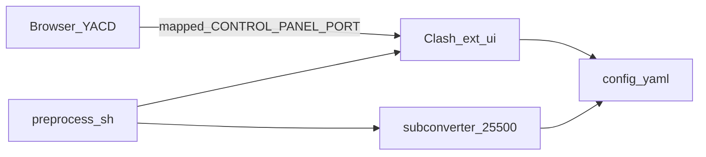

# clash-aio — Cursor / Agent 项目指引

本仓库是**自建的 Clash 一体化容器方案**：用 Docker Compose 同时运行 **Clash（含 YACD Web 控制台）** 与 **subconverter**（订阅转换），辅以 Shell 脚本做宿主机侧运维。**没有**独立的前端/后端应用源码目录（无 `src/` 业务工程），修改行为主要落在 `Dockerfile`、`preprocess.sh`、`subconverter/`、`clash-env.inc.sh` 与 Compose 文件上。

详细安装与部署步骤见 [README.md](README.md)、[README-zh.md](README-zh.md)、[DEPLOYMENT.md](DEPLOYMENT.md)。

## 仓库地图（关键路径）

| 路径 | 作用 |
|------|------|
| [Dockerfile](Dockerfile) | 基于 `dreamacro/clash`；下载 YACD；修补 `index.html`；`COPY preprocess.sh` 后 **`RUN sed` 去掉 CRLF** 并 `chmod +x`；`ENTRYPOINT` 为 `/usr/bin/preprocess.sh` |
| [preprocess.sh](preprocess.sh) | 容器入口：无本地 `config.yaml` 时从 subconverter（容器网络 `:25500`）拉取；失败则写入含 `external-controller` / `external-ui` 的最小配置；`allow-lan`；`exec /clash -ext-ui /ui/public` |
| [docker-compose.yaml](docker-compose.yaml) | `subconverter` + `clash-with-ui`；`env_file: .env`；映射 **`${SUBCONVERTER_HOST_PORT:-25500}:25500`**、`$ALL_PROXY_PORT:7890`、`$CONTROL_PANEL_PORT:9090`（右侧为容器内固定端口） |
| [.gitattributes](.gitattributes) | `*.sh` / `*.inc.sh` 使用 `eol=lf`，减轻 Windows 检出 CRLF 导致的问题 |
| [podman-compose.yaml](podman-compose.yaml) | Podman 场景下的等价编排（含端口/卷等与 Docker 的差异） |
| [subconverter/](subconverter/) | `all_base.tpl`、`pref.toml`：控制 subconverter 输出的 Clash 配置形态（如 `external-controller`、`external-ui`） |
| [.env.example](.env.example) | `RAW_SUB_URL`、`ALL_PROXY_PORT`、`CONTROL_PANEL_PORT`、`SUBCONVERTER_HOST_PORT` 示例 |
| [clash-env.inc.sh](clash-env.inc.sh) | 宿主机脚本 `source`：解析端口，并提供 `clash_require_env_ports_free_for_compose_up`（`compose up` 前校验宿主机端口） |
| 宿主机脚本（`clash-*.sh`） | 见下表；完整命令与示例见 [README-zh.md「脚本一览」](README-zh.md#脚本一览)、[README.md「Script index」](README.md#script-index) |

**宿主机脚本速查**

| 脚本 | 作用 |
|------|------|
| [clash-compose-up.sh](clash-compose-up.sh) | 启动栈（`down` 后 `up -d`）；`up` 前 **`clash_require_env_ports_free_for_compose_up`**；可选参数写回 `ALL_PROXY_PORT` |
| [clash-compose-down.sh](clash-compose-down.sh) | 对本仓库 `docker-compose.yaml` 执行 `docker compose down` |
| [clash-compose-up-verify.sh](clash-compose-up-verify.sh) | 检查 `.env`、**同上端口预检**、`compose up -d`、轮询 `/version` 与代理探测（日常推荐） |
| [clash-verify-mixed-proxy-portmap.sh](clash-verify-mixed-proxy-portmap.sh) | 经 `ALL_PROXY_PORT`（`.env`）与 Docker 端口映射验证容器内 Clash mixed 是否出网 |
| [clash-list-proxies-latency.sh](clash-list-proxies-latency.sh) | 列出节点与延迟 |
| [clash-select-proxy-by-index.sh](clash-select-proxy-by-index.sh) | 按序号切换当前代理 |
| [clash-subscription-hot-reload.sh](clash-subscription-hot-reload.sh) | 订阅热重载（`PUT /configs`，不重建容器） |
| [clash-subscription-rebuild.sh](clash-subscription-rebuild.sh) | 重建 `clash-with-ui` 以重新拉订阅（兜底） |

## 逻辑原理与数据流

1. **首次启动**：若容器内不存在 `/root/.config/clash/config.yaml`，`preprocess.sh` 将 `RAW_SUB_URL` 按需 URL 编码后请求 `http://<subconverter主机>:25500/sub?target=clash&url=...`，把结果写入 `config.yaml`。`subconverter` 主机默认可解析为 `subconverter`；也可通过环境变量 `SUBCONVERTER_IP` 或脚本内的回退探测指定。
2. **拉取失败**：写入最小 `config.yaml`（含 `external-controller: :9090`、`external-ui: /ui/public`、`allow-lan: true`、`mixed-port: 7890`、空规则等），保证控制面与 YACD 仍可用。
3. **运行**：Clash 以 `-ext-ui /ui/public` 启动；`subconverter/all_base.tpl` 中 Clash 段约定 `external-controller: :9090`、`external-ui: /ui/public`，与镜像内路径一致。
4. **宿主机访问**：混合代理口映射为 `ALL_PROXY_PORT → 容器 7890`；控制面（REST API + YACD 静态页）映射为 `CONTROL_PANEL_PORT → 容器 9090`；subconverter 宿主机端口为 **`SUBCONVERTER_HOST_PORT`（默认 25500）** 映射到容器 `25500`。
5. **启动前宿主机端口**：`clash-compose-up.sh` 与 `clash-compose-up-verify.sh` 在 `compose up` 前调用 `clash_require_env_ports_free_for_compose_up`（见 `clash-env.inc.sh`）：三端口须空闲，或已是本栈 `docker port` 对应映射；否则醒目报错并退出（**不会**自动改写 `.env` 换端口）。

## 环境变量（与代码一致）

| 变量 | 含义 |
|------|------|
| `RAW_SUB_URL` | 订阅地址；无本地配置时由 `preprocess.sh` 交给 subconverter |
| `ALL_PROXY_PORT` | 宿主机映射到容器 **7890**（混合代理） |
| `CONTROL_PANEL_PORT` | 宿主机映射到容器 **9090**（API + YACD） |
| `SUBCONVERTER_IP` | 可选；当无法使用主机名 `subconverter` 时指定 subconverter 地址 |
| `SUBCONVERTER_HOST_PORT` | 宿主机访问 subconverter 的映射端口（与 [docker-compose.yaml](docker-compose.yaml) 左端口一致，默认 25500） |

## YACD 与 API 地址（镜像内现状）

- [Dockerfile](Dockerfile) 对 `/ui/public/index.html` 做了 `data-base-url` 替换，并**追加脚本**：支持 URL 查询参数 `hostname` / `host` 覆盖 API 基址；未指定时会对 `window.location.hostname` 拼接默认端口 **9099**（与常见 `CONTROL_PANEL_PORT=9090` 可能不一致）。
- 若浏览器访问的控制端口不是 9099，请使用 `?hostname=你的主机:你的CONTROL_PANEL_PORT`（或等价参数）让 YACD 指向正确的 Clash REST 地址。

## 修改功能时建议打开的入口

- **改生成的 Clash 配置结构 / 规则模板**：`subconverter/all_base.tpl`、`subconverter/pref.toml`
- **改首次拉取订阅、重试、兜底配置、监听 LAN**：`preprocess.sh`
- **改 Web UI 资源或 API 基址相关补丁**：`Dockerfile` 中 YACD 相关步骤
- **改服务依赖、端口映射、镜像构建**：`docker-compose.yaml` / `podman-compose.yaml`
- **改宿主机端口解析或 compose 启动前端口校验**：`clash-env.inc.sh`、`clash-compose-up.sh`、`clash-compose-up-verify.sh`

## 技术栈（一句话）

Docker / Podman、`dreamacro/clash` 镜像、`tindy2013/subconverter` 镜像、预构建 **YACD** 静态资源、Bash/sh 脚本。
